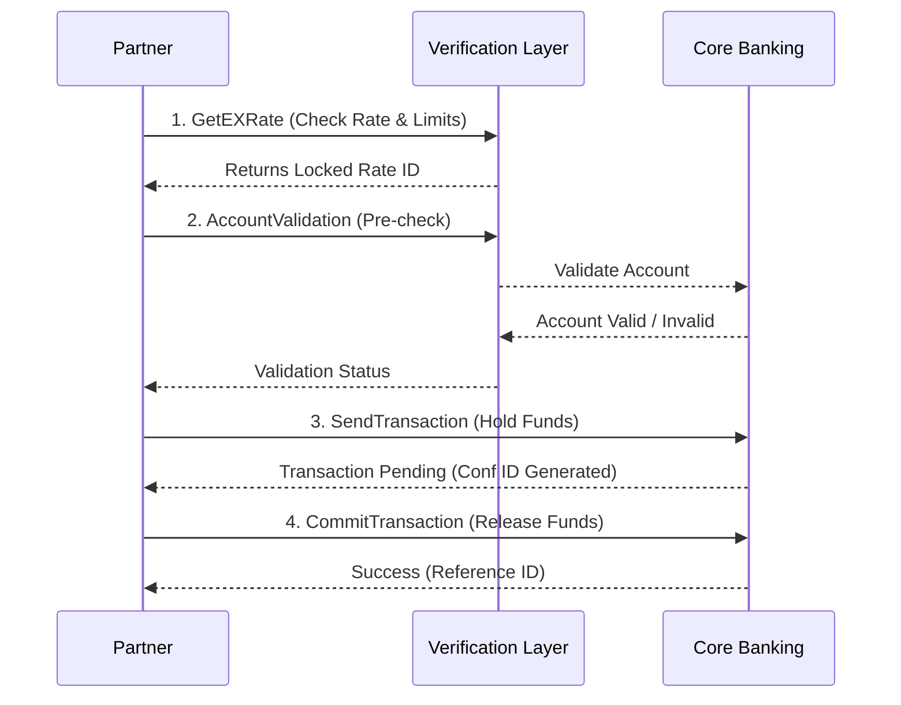

# Nepal Remittance API Integration Project


## Executive Summary

This repository documents the **Remittance API v2.0**, an internal system I managed as the Lead Business Analyst. The API enables international sending partners (Money Transfer Operators, Fintechs, and Banks) to facilitate real-time cross-border remittances to Nepal. The system supports **Bank Deposits, Wallet Loads, and Cash Pickups**, serving as a critical gateway for millions of dollars in monthly remittance inflow.

This documentation serves as a comprehensive guide to my contributions, the business value delivered, and the technical specifications of the system.

---

## 1. Business Problem

In the cross-border remittance industry, speed and reliability are paramount. Our previous integration process was manual and prone to errors, leading to significant friction for our international partners.
*   **Operational Inefficiency**: Partners struggled with unclear requirements, leading to a 4-week onboarding cycle.
*   **High Failure Rates**: Transactions often failed *after* funds were collected due to incorrect account details or compliance blocks.
*   **Compliance Risks**: Manual checks for Anti-Money Laundering (AML) were slow and risky.

We needed a robust, automated API gateway that could handle high volumes, enforce strict compliance rules in real-time, and provide a seamless "plug-and-play" experience for our partners.

## 2. Business Objectives & Value

Our primary goal was to modernize the remittance corridor to Nepal.
*   **Success Rates**: Improve straight-through processing (STP) rates to >98% by validating data upfront.
*   **Speed**: Achieve near real-time credit (under 60 seconds) for Bank and Wallet transfers.
*   **Scalability**: Enable the system to handle 3x significantly higher transaction volumes during festival seasons.
*   **Partner Experience**: Reduce the technical integration timeline from 30 days to 14 days.

## 3. My Role (BA Perspective)

As the **Business Analyst**, I acted as the product owner for this API integration. I bridged the gap between our internal engineering team and external business partners.


## 4. Stakeholders & Collaboration

Success required distinct collaboration across the business:
*   **Product Team**: To define the pricing and margin logic for different remittance corridors.
*   **Compliance & Risk**: To ensure every transaction passed Global Sanctions Screening and Nepal Rastra Bank limits.
*   **Treasury**: To manage the pre-funding and liquidity requirements for real-time payouts.
*   **Engineering**: To implement the logic, ensuring high availability and secure data transmission.

## 5. Functional & Non-Functional Requirements

### Functional Requirements (FR)
*   **Validation**: The system must validate Bank Account numbers against the Core Banking System before capturing funds (`AccountValidation`).
*   **Modes**: Support three specific payout modes: Bank Deposit (B), Wallet Load (W), and Cash Pickup (C).
*   **Compliance**: Automatically reject transactions exceeding 100,000 NPR if "Source of Funds" is missing.
*   **Exchange Rate**: Provide a guaranteed exchange rate valid for a 15-minute session window.

### Non-Functional Requirements (NFR)
*   **Performance**: API response time must be under 200ms for 95% of requests.
*   **Security**: All payloads must be secured with HMAC-SHA256 signatures to ensure data integrity.
*   **Availability**: The system must ensure 99.9% uptime, especially during high-traffic windows (weekends/holidays).
*   **Idempotency**: The system must safely handle retry requests without creating duplicate transactions.

## 6. User Stories & Acceptance Criteria

To guide development, I authored detailed user stories. Examples include:

*   **Story**: *As a Partner Agent, I want to verify the beneficiary's account name before sending money, so that I don't send funds to the wrong person.*
    *   **Acceptance Criteria**: The `AccountValidation` endpoint must return the Account Holder's Name if the account exists. If invalid, return Error 104 (Invalid Account).

*   **Story**: *As a Compliance Officer, I need the system to block daily transfers exceeding 5 transactions per sender to prevent structuring fraud.*
    *   **Acceptance Criteria**: If a 6th transaction is attempted by the same Sender ID in 24 hours, return Error 429 (Daily Limit Exceeded).

---

## 7. Process / System Flow Explanation

We implemented a **Two-Phase Commit** pattern to ensure financial consistency. This prevents "ghost" transactions where money is deducted but not received.

1.  **Rate Locking**: The partner asks "What is the rate?" (`GetEXRate`). We lock this rate for them.
2.  **Validation**: The partner asks "Does this account exist?" (`AccountValidation`). We confirm against the switch.
3.  **Send (Phase 1)**: The partner initiates the transfer (`SendTransaction`). We validate KYC and **hold** the transaction in a "Pending" state. No funds are moved to the beneficiary yet.
4.  **Commit (Phase 2)**: The partner confirms they have collected funds (`CommitTransaction`). Only then do we release the payout to the beneficiary.

### Transaction Lifecycle Diagram



> *For the full system state machine, see [System Diagrams](./documentation/Process-Flows/System_Diagrams.md)*

## 8. API / Integration Examples

The API uses rigid JSON contracts. Below is an example of the core `SendTransaction` request.

**Request: Initiate Transfer**
```json
{
  "agentTxnId": "PARTNER_REF_88291",
  "senderFirstName": "John",
  "senderLastName": "Doe",
  "senderSourceOfFund": "Salary",
  "receiverFirstName": "Ram",
  "receiverLastName": "Sharma",
  "transferAmount": 50000,
  "paymentMode": "B",
  "bankAccountNumber": "012000293810001",
  "bankName": "Nabil Bank Ltd"
}
```

**Response: Success**
```json
{
    "code": "0",
    "message": "Transaction Initiated Successfully",
    "data": {
        "status": "Unpaid_Hold",
        "payoutAmount": 50000,
        "confirmationId": "882910002"
    }
}
```

## 9. Risks, Edge Cases & Mitigations

*   **Risk: Network Timeouts**: A partner might send a request but not receive the response due to internet issues.
    *   *Mitigation*: We mandated **Idempotency**. If a partner retries the same `agentTxnId`, we return the *existing* status instead of creating a new duplicate transaction.
*   **Risk: Fraudulent IDs**: Senders might use fake IDs.
    *   *Mitigation*: We implemented regex validation on `SenderIdNumber` based on the selected `IdType` (e.g., Passport must be alphanumeric).

## 10. Success Metrics / KPIs

The launch of this v2.0 API delivered measurable business impact:
*   **15% Reduction** in failed transactions due to the  `AccountValidation` step.
*   **30% Faster Integration** for new partners.
*   **Zero** compliance penalties in operation due to strict field validation.

## 11. Deliverables Produced

During this project, I produced and maintained the following artifacts:
*   **Business Requirement Document (BRD)**: The source of truth for all logic.
*   **API Specification**: Detailed  definitions for engineering.
*   **[Onboarding Checklist](./documentation/Requirements/Onboarding_Checklist.md)**: A step-by-step tracker for partner integrations.
*   **Process Flows**: Visual diagrams mapping the money movement and error handling.
*   **Error Code Matrix**: A standardized list of 50+ error codes to help partners debug issues instantly.

## 12. Key Learnings

This project reinforced that **Business Analysis is about Translation**. My ability to translate complex banking regulation into simple `IF/ELSE` logic for developers was critical. I also learned that "Happy Paths" are easy; the real value of a BA lies in defining the "Unhappy Paths"—what happens when the bank is down, when the ID is expired, or when the network times out. Designing for failure ensured our system was robust enough for success.

---

## Repository Structure

| Directory | Content Description |
|-----------|-------------------|
| **[Requirements](./documentation/Requirements/)** | Business Rules (KYC, Limits) and Partner Onboarding Checklists. |
| **[API Documentation](./documentation/API/)** | Detailed Integration Guide and Standardized Error Codes. |
| **[Process Flows](./documentation/Process-Flows/)** | Mermaid-based Transaction Life-cycles and Onboarding Workflows. |
| **[Examples](./examples/)** | Sample JSON payloads for Request/Response cycles. |

## Endpoints Overview

| Endpoint | Method | Purpose | Business Value |
|----------|--------|---------|----------------|
| `/GetEcho` | POST | Connectivity Check | Ensures heartbeat before traffic spikes. |
| `/GetEXRate` | POST | Get Exchange Rate | Guarantee rate to customer for safety. |
| `/AccountValidation` | POST | Validate Beneficiary | **Reduces reversals** by rejecting invalid accounts upfront. |
| `/SendTransaction` | POST | Initiate Transfer | Performs KYC logs and holds inventory. |
| `/CommitTransaction` | POST | Finalize Transfer | Confirms funds are collected; releases to beneficiary. |
| `/QueryTXNStatus` | POST | Check Status | Automated reconciliation for "Pending" states. |
| `/CancelTransaction` | POST | Cancel Request | Allows voiding before payout (e.g., fraud suspicion). |
