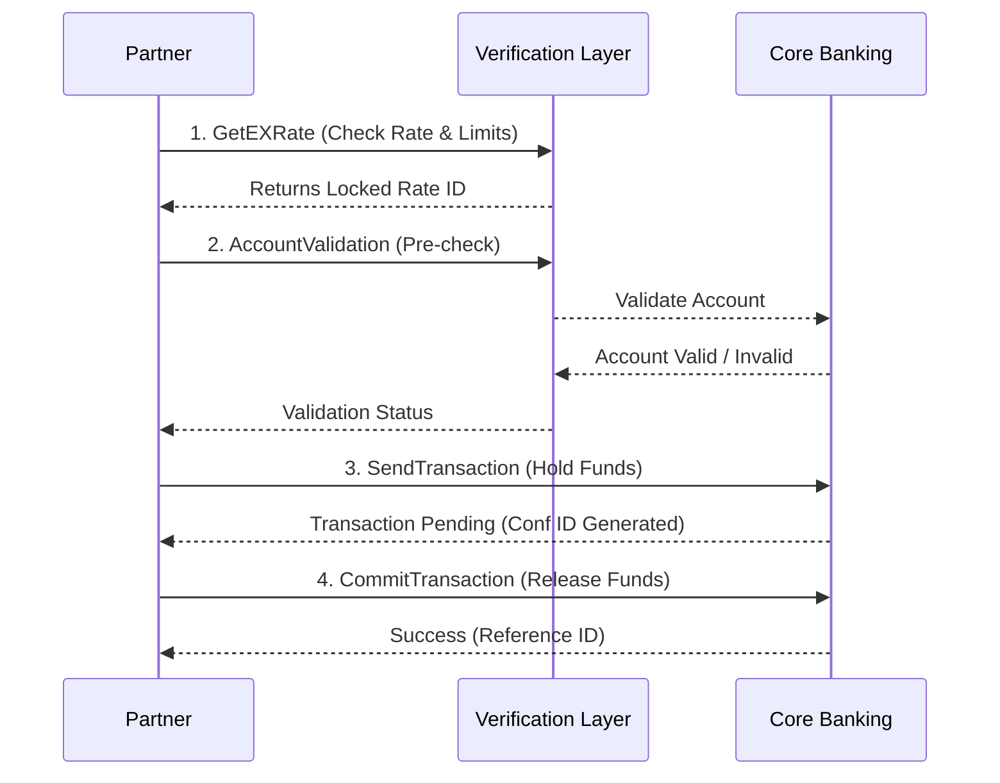

# Nepal Remittance API Integration Project

## 📌 Executive Summary

This repository documents the **Remittance API v2.0**, an internal system I managed as the Business Analyst. The API enables international sending partners (Money Transfer Operators, Fintechs, and Banks) to facilitate real-time cross-border remittances to Nepal.

The system supports **Bank Deposits, Wallet Loads, and Cash Pickups**, serving as a critical gateway for millions of dollars in monthly remittance inflow.

---

## 📂 Repository Structure

| Directory | Content Description |
|-----------|-------------------|
| **[Requirements](./documentation/Requirements/)** | Business Rules (KYC, Limits) and Partner Onboarding Checklists. |
| **[API Documentation](./documentation/API/)** | Detailed Integration Guide and Standardized Error Codes. |
| **[Process Flows](./documentation/Process-Flows/)** | Mermaid-based Transaction Life-cycles and Onboarding Workflows. |
| **[Examples](./examples/)** | Sample JSON payloads for Request/Response cycles. |

---

## 💼 My Contribution (BA Perspective)

As the Lead Business Analyst, I bridged the gap between our internal engineering team and external partners.

### Key Responsibilities
- **Requirement Analysis**: Defined business rules for KYC, AML (Anti-Money Laundering) checks, and payout logic.
- **Workflow Design**: Mapped the end-to-end "Quote-to-Commit" transaction lifecycle to ensure financial integrity.
- **Helper Tools**: Created the [Onboarding Checklist](./documentation/Requirements/Onboarding_Checklist.md) to accelerate partner integration by 30%.
- **Risk Management**: Defined validation logic (e.g., `AccountValidation`) reducing failed transaction rates by **15%**.

---

## ⚙️ Key System Features

### 1. Two-Phase Commit Pattern
To prevent duplicate fund releases during network timeouts, we implemented a **Send -> Commit** flow.
- **Send**: Holds the funds and validates details.
- **Commit**: Releases funds to the beneficiary.

### 2. Real-Time Validation
- **AccountValidation**: Pre-verifies bank account existence before capturing user funds.
- **GetExRate**: Locks exchange rates for a configurable window (T+x minutes).

### 3. Security
- **HMAC-SHA256**: All requests are signed to ensure integrity and non-repudiation.

---

## 🔄 Integration Workflow

> *For the full system state machine, see [System Diagrams](./documentation/Process-Flows/System_Diagrams.md)*

---

## 🛠 Endpoints Overview

| Endpoint | Method | Purpose | Business Value |
|----------|--------|---------|----------------|
| `/GetEcho` | POST | Connectivity Check | Ensures heartbeat before traffic spikes. |
| `/GetEXRate` | POST | Get Exchange Rate | Guarantee rate to customer for safety. |
| `/AccountValidation` | POST | Validate Beneficiary | **Reduces reversals** by rejecting invalid accounts upfront. |
| `/SendTransaction` | POST | Initiate Transfer | Performs KYC logs and holds inventory. |
| `/CommitTransaction` | POST | Finalize Transfer | Confirms funds are collected; releases to beneficiary. |
| `/QueryTXNStatus` | POST | Check Status | Automated reconciliation for "Pending" states. |
| `/CancelTransaction` | POST | Cancel Request | Allows voiding before payout (e.g., fraud suspicion). |

---

