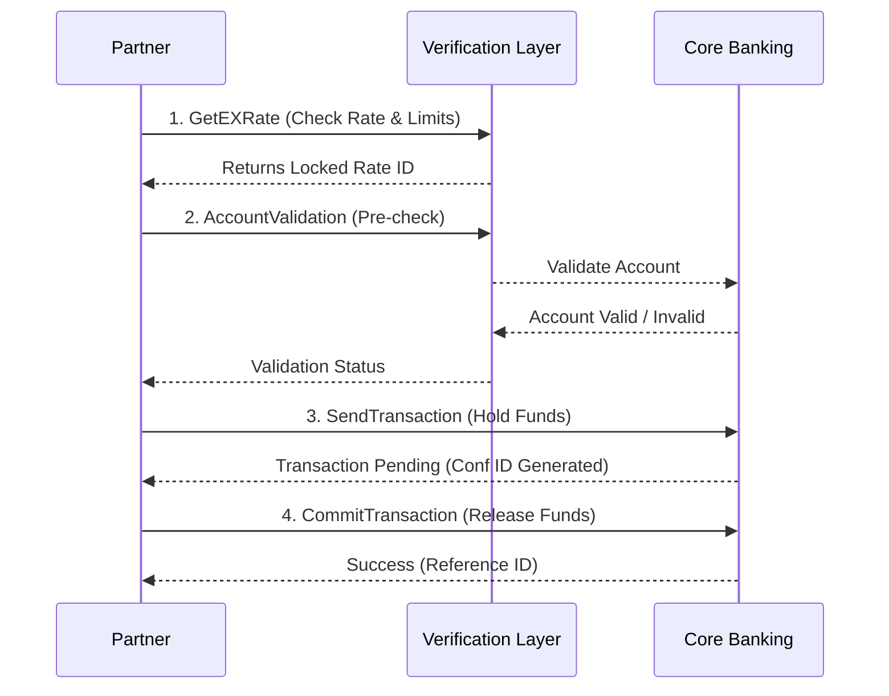

# Nepal Remittance API Integration Project

> **Role:** Business Analyst  
> **Project Type:** B2B API Integration  

##  Project Overview
This repository documents the **Remittance API v2.0**, an internal system I managed as the Business Analyst. The API enables international sending partners (Money Transfer Operators, Fintechs, and Banks) to facilitate real-time cross-border remittances to Nepal.

The system supports **Bank Deposits, Wallet Loads, and Cash Pickups**, serving as a critical gateway for millions of dollars in monthly remittance inflow.

###  My Contribution (BA Perspective)
As the BA, I bridged the gap between our internal engineering team and external partners. My responsibilities included:
- **Requirement Analysis**: Defined business rules for KYC, AML (Anti-Money Laundering) checks, and payout logic.
- **Workflow Design**: Mapped the end-to-end "Quote-to-Commit" transaction lifecycle to ensure financial integrity.
- **Partner Onboarding**: Created the integration guides, managed UAT (User Acceptance Testing), and resolved integration blockers.
- **Risk Management**: Defined validation logic (e.g., `AccountValidation` endpoint) to reduce failed transaction rates by 15%.

---

##  Key Features
- **Idempotency & Safety**: Implements a **Two-Phase Commit** (Send -> Commit) pattern to prevent duplicate fund releases during network timeouts.
- **Real-Time Validation**:
  - `AccountValidation`: Pre-verifies bank account existence before capturing user funds.
  - `GetExRate`: Locks exchange rates for a configurable window to guarantee recipient amounts.
- **Security**: SHA-256 HMAC signature authentication ensures request integrity and non-repudiation.

---

##  Integration Workflow
The integration follows a strict sequence to ensure data consistency and regulatory compliance.

##  Documentation Structure
This repository mimics the actual documentation package provided to partners:

- **[Integration Guide](docs/integration_guide.md)**: Detailed step-by-step technical implementation flow.
- **[Business Rules & Compliance](docs/business_rules.md)**: KYC requirements, limit logic, and mandatory fields.
- **[Error Code Mapping](docs/error_codes.md)**: How to handle functional vs. technical failures.
- **[Checklists](checklists/partner_onboarding.md)**: The "Go-Live" readiness tracker I used with partners.

## 🛠 endpoints at a Glance
| Endpoint | Method | Purpose | Business Value |
|----------|--------|---------|----------------|
| `/GetEcho` | POST | Connectivity Check | Ensures heartbeat before traffic spikes. |
| `/GetEXRate` | POST | Get Exchange Rate | guarantees rate to customer for T+x minutes. |
| `/AccountValidation` | POST | Validate Beneficiary | **Reduces reversals** by rejecting invalid accounts upfront. |
| `/SendTransaction` | POST | Initiate Transfer | Performs KYC logs and holds inventory. |
| `/CommitTransaction` | POST | Finalize Transfer | Confirms funds are collected; releases to beneficiary. |
| `/QueryTXNStatus` | POST | Check Status | Automated reconciliation for "Pending" states. |
| `/CancelTransaction` | POST | Cancel Request | Allows voiding before payout (e.g., fraud suspicion). |

---

*Note: This repository is a **portfolio showcase**. All sensitive keys, internal IPs, and production data have been replaced with placeholders.*
