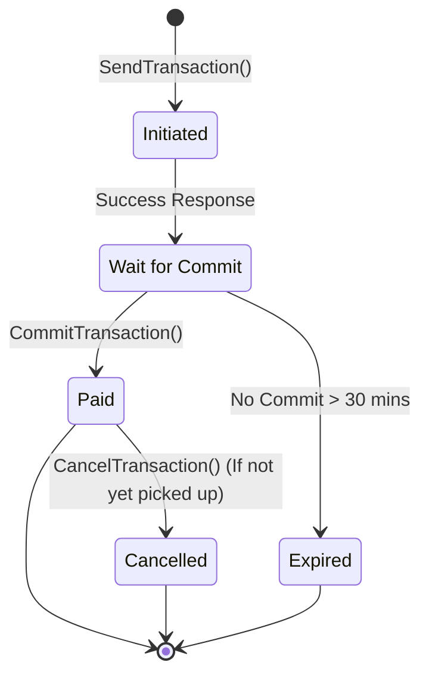
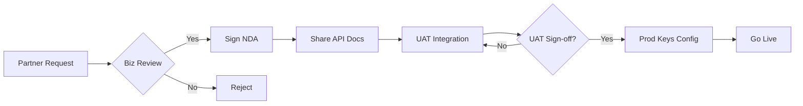

# System Diagrams

## 1. Transaction Status Lifecycle
This state machine illustrates the lifecycle of a remittance transaction from initiation to final payout.

## 2. Partner Onboarding Process Flow
A high-level view of how we bring new partners live.

